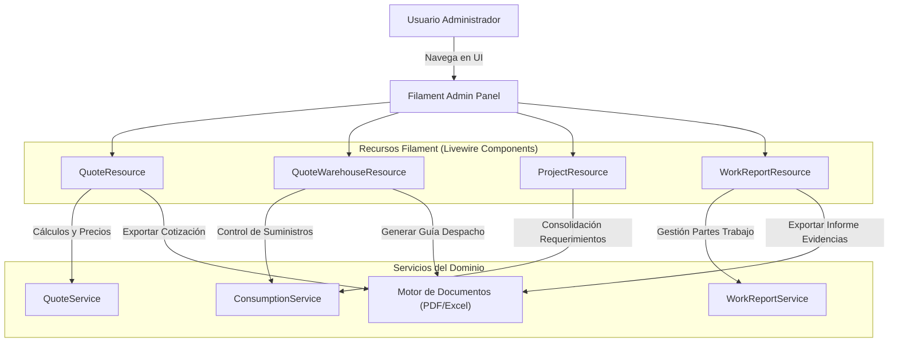

# C4 — Nivel 3: Diagrama de Componentes (Panel Administrativo Web)

## Contenedor Target

**Aplicación Backend & Panel Web — Módulo Admin Filament** (`Filament 4.3` / `Livewire` / `Blade`)

---

## Responsabilidad del Módulo

Proporcionar una interfaz web administrativa responsiva, segura e interactiva para la gestión completa de las operaciones de la empresa: administración de clientes y subclientes, registro de empleados y cargos, control de proyectos de ingeniería, emisión y aprobación de cotizaciones, gestión de almacenes de cotización y guías de despacho, partes de asistencia (timesheets) y exportación de reportes ejecutivos.

---

## Componentes del Panel Administrativo

| Componente | Responsabilidad | Evidencia en Código |
| ---------- | --------------- | ------------------- |
| **Recursos de Clientes (ClientResource & SubClientResource)** | Gestión de datos de clientes corporativos, contactos, CECOs y subclientes asociados. | `app/Filament/Resources/Clients/`, `app/Models/Client.php`, `app/Models/SubClient.php` |
| **Recursos de Personal (EmployeeResource & ComplianceResource)** | Registro de empleados, cargos, asignaciones a proyectos y actas de conformidad. | `app/Filament/Resources/Employees/`, `app/Filament/Resources/Compliances/` |
| **Recursos de Cotizaciones y Precios (QuoteResource & PricelistResource)** | Creación de cotizaciones por categorías, lista de precios, descuentos y vista previa. | `app/Filament/Resources/Quotes/`, `app/Filament/Resources/Pricelists/` |
| **Recursos de Almacén (QuoteWarehouseResource)** | Gestión de almacenes de cotización, guías de despacho y transferencias de suministros. | `app/Filament/Resources/QuoteWarehouses/`, `app/Models/QuoteWarehouse.php` |
| **Recursos de Proyectos y Requerimientos (ProjectResource & ProjectRequirementResource)** | Control de proyectos activos, lista de requerimientos por proyecto y estados Kanban de atención. | `app/Filament/Resources/Projects/`, `app/Filament/Resources/ProjectRequirements/` |
| **Recursos de Campo y Reportes (WorkReportResource & VisitReportResource)** | Supervisión y aprobación de reportes diarios de trabajo, reportes de visitas técnicas y consolidación. | `app/Filament/Resources/WorkReports/`, `app/Filament/Resources/VisitReports/` |
| **Gestión de Permisos y Roles (Filament Shield)** | Integración con Spatie Laravel Permission para control de acceso basado en roles (RBAC). | `composer.json` (`bezhansalleh/filament-shield`), `config/permission.php` |

---

## Diagrama de Interacción entre Recursos y Servicios

