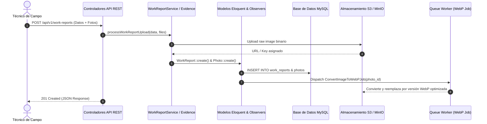

# C4 — Nivel 3: Diagrama de Componentes (Backend & API)

## Contenedor Target

**Aplicación Backend & Panel Web** (`PHP 8.3` / `Laravel 12.0` / `Filament 4.3`)

---

## Responsabilidad del Contenedor

Procesar peticiones HTTP/REST API, renderizar la interfaz administrativa interactiva con Filament, ejecutar reglas de negocio de proyectos, cotizaciones y almacenes, gestionar la autenticación y permisos de usuarios (Sanctum/Shield), generar reportes exportables (PDF, Excel, Word), y gestionar la persistencia y emisión de eventos del sistema.

---

## Componentes Principales Identificados

| Componente | Responsabilidad | Tipo de Componente | Evidencia en Código |
| ---------- | --------------- | ------------------ | ------------------- |
| **Módulo Admin Filament** | Colección de clases Resource, Page y Widget de Filament v4 que definen la interfaz gráfica y flujo CRUD para la administración de clientes, empleados, proyectos, cotizaciones y reportes. | Interfaz de Usuario / Controller Layer | `app/Filament/Resources/`, `app/Filament/Widgets/` |
| **Controladores API REST** | Endpoints HTTP expuestos para consumo por clientes móviles/externos que gestionan la autenticación (Sanctum), sincronización de catálogos y registro de datos de campo. | Controller Layer | `app/Http/Controllers/Api/`, `app/Http/Controllers/AuthController.php`, `routes/api.php` |
| **Servicios del Dominio** | Clases de servicio dedicadas que encapsulan reglas de negocio complejas (cálculo de cotizaciones, desglose de consumo de materiales, reportes consolidados y conversión de imágenes). | Business Logic Layer | `app/Services/QuoteService.php`, `app/Services/ConsumptionService.php`, `app/Services/RequestConsolidatedService.php`, `app/Services/WorkReportService.php` |
| **Motor de Generación de Documentos** | Módulo encargado del formateo y renderizado de actas de conformidad, reportes de visita y cotizaciones en formatos PDF (DomPDF, mPDF), Excel (PhpSpreadsheet) y Word (PhpWord). | Document Engine / Export Layer | `app/Http/Controllers/ExcelExportController.php`, `app/Http/Controllers/WorkReportExcelController.php`, `app/Http/Controllers/WorkReportWordController.php`, `app/Services/*PdfService.php` |
| **Capa de Persistencia y Observers** | Modelos Eloquent que representan las tablas de la base de datos relacional y observadores que auditan y desencadenan acciones ante eventos de ciclo de vida de los datos. | Domain Model & Event Triggers | `app/Models/Project.php`, `app/Models/Quote.php`, `app/Models/WorkReport.php`, `app/Observers/QuoteObserver.php`, `app/Observers/QuoteWarehouseObserver.php` |
| **Módulo de Notificaciones y Eventos** | Gestión centralizada de emisión de eventos broadcasting en tiempo real (Reverb) y generación de notificaciones push firmadas con VAPID. | Real-Time & Notification Layer | `app/Events/MessageSent.php`, `app/Notifications/GeneralPushNotification.php`, `app/Services/PushNotificationService.php` |

---

## Relaciones entre Componentes Internos

| Componente Origen | Componente Destino | Tipo de Interacción | Propósito |
| ----------------- | ------------------ | ------------------- | --------- |
| **Módulo Admin Filament** | **Servicios del Dominio** | Llamada directa PHP | Procesar cálculos de totales de cotización, requerimientos consolidables y partes de trabajo. |
| **Módulo Admin Filament** | **Capa de Persistencia** | Queries Eloquent ORM | Operaciones CRUD sobre entidades como `Client`, `Project`, `QuoteWarehouse` y `Timesheet`. |
| **Módulo Admin Filament** | **Motor de Documentos** | Invoca generación | Descarga o previsualización de Actas de Conformidad y Reportes de Trabajo desde la interfaz. |
| **Controladores API REST** | **Servicios del Dominio** | Llamada directa PHP | Delegar el registro de partes de trabajo de campo o búsquedas filtradas de listas de precios. |
| **Controladores API REST** | **Capa de Persistencia** | Queries Eloquent ORM | Autenticar usuarios con tokens Sanctum y almacenar registros de asistencia/fotos de campo. |
| **Servicios del Dominio** | **Capa de Persistencia** | Manipulación de Modelos | Actualización de estados de almacén, recálculo de costos y vinculación de evidencias. |
| **Servicios del Dominio** | **Motor de Documentos** | Paso de DTOs / Arreglos | Proveer estructuras de datos procesadas para el renderizado de plantillas Blade/PDF. |
| **Capa de Persistencia (Observers)** | **Módulo de Notificaciones** | Event Triggers | Desencadenar eventos de cambio de estado o notificaciones cuando una cotización/almacén cambia. |
| **Módulo de Notificaciones** | **Servidor WebSockets** | HTTP Payload | Despachar payload de eventos real-time vía Laravel Reverb API. |
| **Módulo de Notificaciones** | **Servicio Push VAPID** | HTTP Push Protocol | Enviar notificaciones push a los navegadores del personal técnico/administrativo. |

---

## Flujo de Ejecución Principal: Registro y Generación de Reporte de Trabajo con Evidencia

