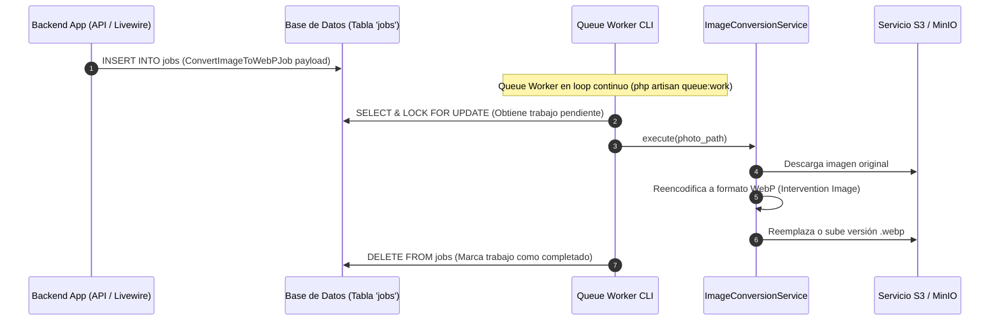

# C4 — Nivel 3: Diagrama de Componentes (Procesamiento Asíncrono y Tiempo Real)

## Contenedores Target

- **Servidor WebSockets (Laravel Reverb)** (`Laravel Reverb 1.8`)
- **Procesador de Colas (Queue Worker)** (`PHP CLI Worker`)

---

## Responsabilidad

Garantizar la capacidad de respuesta en tiempo real de la plataforma mediante canales WebSockets bidireccionales y procesar de forma desacoplada las tareas pesadas en segundo plano (optimización de imágenes de evidencia a WebP, notificaciones push masivas y actualización diferida de índices).

---

## Componentes y Procesos Identificados

| Componente / Proceso | Responsabilidad | Evidencia en Código |
| -------------------- | --------------- | ------------------- |
| **Laravel Reverb Engine** | Servidor WebSocket standalone ejecutado mediante `php artisan reverb:start`. Escucha eventos broadcast y los distribuye a sockets suscritos. | `supervisord.conf` (`[program:reverb]`), `composer.json` (`laravel/reverb ^1.8`), `.env` (`BROADCAST_CONNECTION=reverb`) |
| **Canales de Transmisión (`routes/channels.php`)** | Define la autorización y estructura de presencia para los canales de WebSocket (ej. canales privados de chat y notificaciones). | `routes/channels.php` |
| **Eventos Broadcasting (`MessageSent`)** | Eventos PHP que implementan `ShouldBroadcastNow` o `ShouldBroadcast` para notificar mensajes de chat en tiempo real a clientes conectados. | `app/Events/MessageSent.php` |
| **Queue Worker Process** | Proceso daemon CLI ejecutado mediante `php artisan queue:work --tries=3 --timeout=90`. Polling permanente a la tabla `jobs`. | `supervisord.conf` (`[program:worker]`), `.env` (`QUEUE_CONNECTION=database`) |
| **Job de Conversión de Imagen (`ConvertImageToWebPJob`)** | Trabajo asíncrono que procesa imágenes pesadas subidas desde campo, las redimensiona y las convierte al formato WebP mediante `Intervention/Image`. | `app/Jobs/ConvertImageToWebPJob.php`, `composer.json` (`intervention/image ^3.11`), `app/Services/ImageConversionService.php` |
| **Canal de Notificaciones Push (`GeneralPushNotification`)** | Despacho asíncrono de notificaciones WebPush hacia el servicio VAPID configurado en el sistema. | `app/Notifications/GeneralPushNotification.php`, `composer.json` (`laravel-notification-channels/webpush`) |

---

## Flujo de Trabajo Asíncrono de Procesamiento de Fotografías

