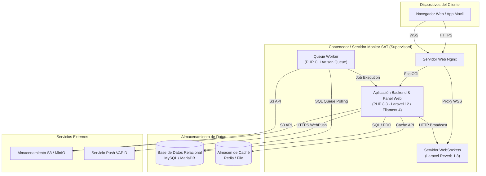

# C4 — Nivel 2: Diagrama de Contenedores (Containers)

## Arquitectura General

El **Sistema Monitor SAT** está estructurado como una **arquitectura monolítica modular basada en Laravel 12 y Filament 4**, complementada con un proceso de comunicación WebSocket independiente (**Laravel Reverb**) y un motor de ejecución en segundo plano (**Queue Worker**). La infraestructura se orquesta mediante **Supervisord** y **Nginx** en un contenedor de aplicación (compatible con Nixpacks/Docker).

El diagrama de contenedores responde a la pregunta:

> *¿Cómo está estructurado el sistema y cuáles son sus principales unidades ejecutables y de almacenamiento?*

---

## Contenedores Identificados

| Contenedor | Responsabilidad | Tecnología Principal | Evidencia de Código / Config |
| ---------- | --------------- | -------------------- | ---------------------------- |
| **Servidor Web Nginx** | Recepción de tráfico HTTP/HTTPS, terminación SSL, entrega de activos estáticos comprimidos y proxy inverso hacia el socket PHP-FPM y el puerto WebSocket. | `Nginx 1.2x` | `supervisord.conf` (`[program:nginx]`), `nginx.template.conf`, `nixpacks.toml` |
| **Aplicación Backend & Panel Web** | Monolito de aplicación que sirve la interfaz web de Filament, expone la API REST JSON, procesa la lógica de negocios del dominio, genera documentos (PDF/Excel/Word) y gestiona la sesión del usuario. | `PHP 8.3` / `Laravel 12.0` / `Filament 4.3` | `composer.json` (`laravel/framework ^12.0`, `filament/filament ^4.3.1`), `app/` |
| **Servidor WebSockets (Reverb)** | Servidor independiente de WebSockets escrito en PHP/Swoole/ReactPHP que gestiona conexiones persistentes bidireccionales para chat en tiempo real y difusión de eventos (`broadcasting`). | `Laravel Reverb 1.8` / `PHP CLI` | `supervisord.conf` (`[program:reverb]`), `composer.json` (`laravel/reverb ^1.8`), `routes/channels.php` |
| **Procesador de Colas (Queue Worker)** | Proceso ejecutable CLI en segundo plano que procesa colas de trabajos asíncronos (conversión de imágenes a WebP, notificaciones pesadas y tareas en diferido). | `PHP CLI` / `Laravel Queue Worker` | `supervisord.conf` (`[program:worker]`), `app/Jobs/ConvertImageToWebPJob.php`, `.env` (`QUEUE_CONNECTION=database`) |
| **Base de Datos Relacional** | Almacena el modelo relacional de datos de la empresa (proyectos, clientes, cotizaciones, reportes, timesheets, usuarios), la tabla de trabajos de cola `jobs` y las sesiones de usuario. | `MySQL` / `MariaDB` | `composer.json` (`ext-pdo_mysql`), `.env` (`DB_CONNECTION=mysql`, `DB_DATABASE=satindex_monitor_legacy`) |
| **Almacén de Caché** | Almacenamiento rápido de datos temporales, claves de sesión o valores en caché de la aplicación. | `Redis` / `File Cache` | `composer.json` (`ext-redis`, `predis/predis ^3.4`), `.env` (`REDIS_CLIENT=predis`, `CACHE_STORE=file`) |

---

## Matriz de Relaciones entre Contenedores

| Contenedor Origen | Contenedor Destino | Protocolo / Canal | Propósito de la Comunicación |
| ----------------- | ------------------ | ----------------- | ---------------------------- |
| **Nginx** | **Aplicación Backend** | FastCGI / Unix Socket (`/run/php-fpm.sock`) | Redirección de peticiones dinámicas HTTP/HTTPS del panel web y la API REST al proceso PHP-FPM. |
| **Nginx** | **Servidor WebSockets (Reverb)** | HTTP / WSS Proxy (`http://127.0.0.1:8080`) | Proxy inverso para actualizar peticiones HTTP Upgrade a sockets WebSockets persistentes. |
| **Aplicación Backend** | **Base de Datos Relacional** | TCP / SQL (`port 3306`) | Consultas de lectura/escritura mediante Eloquent ORM y ejecución de transacciones. |
| **Aplicación Backend** | **Almacén de Caché** | Redis Protocol / Filesystem | Consulta y actualización de ítems en caché y almacenamiento de datos de sesión. |
| **Aplicación Backend** | **Servidor WebSockets (Reverb)** | HTTP REST API (`port 8080`) | Publicación de eventos en tiempo real mediante el cliente Reverb al emitir eventos broadcast (`MessageSent`). |
| **Aplicación Backend** | **Servicio de Almacenamiento S3** | HTTPS / S3 API (`port 9000/443`) | Subida y descarga directa de archivos binarios, fotos de evidencias y documentos generados. |
| **Aplicación Backend** | **Servicio Push VAPID** | HTTPS / WebPush Protocol | Despacho de notificaciones push de navegador cifradas con claves VAPID. |
| **Queue Worker** | **Base de Datos Relacional** | TCP / SQL (`port 3306`) | Polling y reserva de trabajos pendientes desde la tabla `jobs` (`php artisan queue:work`). |
| **Queue Worker** | **Aplicación Backend** | PHP Internal Code Execution | Ejecución directa de los métodos `handle()` de las clases Job del proyecto (`ConvertImageToWebPJob`). |
| **Queue Worker** | **Servicio de Almacenamiento S3** | HTTPS / S3 API | Almacenamiento de imágenes reescaladas u optimizadas en formato WebP. |

---

## Diagrama de Contenedores (Vista Merged)

