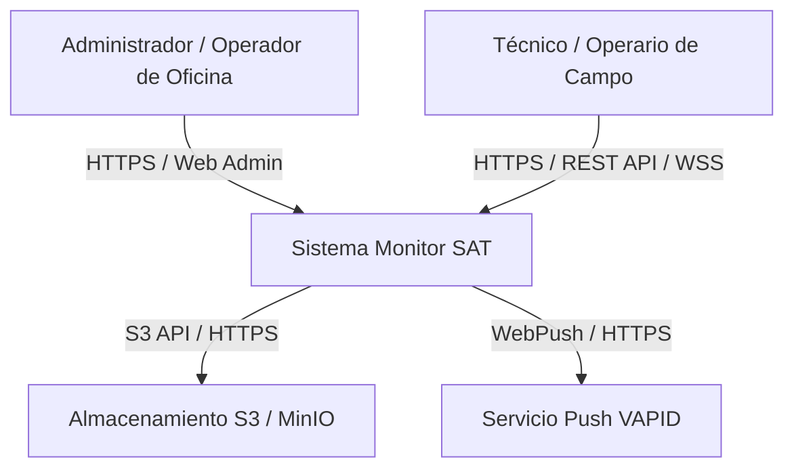

# C4 — Nivel 1: Diagrama de Contexto (System Context)

## Propósito

El Diagrama de Contexto del Sistema muestra el **Sistema Monitor SAT** en su entorno global, identificando los actores (personas) que interactúan con él y los sistemas externos con los que se integra. Responde a la pregunta fundamental:

> *¿Qué es el Sistema Monitor SAT y con qué usuarios y sistemas externos interactúa?*

---

## Descripción del Sistema

El **Sistema Monitor SAT** es la plataforma tecnológica central de **SAT Industriales** diseñada para la gestión operativa, control de proyectos de ingeniería/mantenimiento, elaboración de cotizaciones, emisión de guías de despacho/almacén, registro diario de trabajo en campo (timesheets/reportes), captura de evidencias fotográficas, seguimiento de visitas técnicas y emisión de actas de conformidad.

---

## Actores (Personas)

| Actor | Descripción | Interacción Principal | Evidencia en Código |
| ----- | ----------- | -------------------- | ------------------- |
| **Administrador / Operador de Oficina** | Usuario del personal administrativo, operaciones, finanzas o almacén. | Accede al panel administrativo web para crear proyectos, emitir cotizaciones, aprobar partes de trabajo, gestionar almacenes y exportar actas en PDF/Excel. | `app/Filament/Resources/`, `app/Models/User.php`, `config/permission.php` |
| **Técnico / Operario de Campo** | Personal técnico desplegado en instalaciones de clientes o proyectos. | Utiliza la API REST (vía app móvil o web de campo) para marcar asistencia/timesheets, registrar avances de partes de trabajo, subir fotografías y chatear en tiempo real. | `routes/api.php`, `app/Http/Controllers/WorkReportController.php`, `app/Http/Controllers/TimesheetController.php` |

---

## Sistemas Externos

| Sistema Externo | Propósito | Tipo de Integración | Evidencia en Código |
| --------------- | --------- | ------------------- | ------------------- |
| **Servicio de Almacenamiento S3 / MinIO** | Almacenar objetos binarios pesados (fotografías de evidencias de trabajo, fotos de perfil, imágenes de visitas y archivos PDF persistidos). | Protocolo S3 API (HTTP/HTTPS) mediante AWS SDK V3 Flysystem. | `composer.json` (`league/flysystem-aws-s3-v3`), `.env` (`FILESYSTEM_DISK=s3`, `AWS_ENDPOINT=http://192.168.10.16:9000`) |
| **Servicio Push (WebPush / VAPID)** | Enviar notificaciones push nativas del navegador o dispositivo cuando ocurren eventos importantes (asignaciones de proyectos, alertas). | Protocolo WebPush VAPID mediante canal Laravel Notification. | `composer.json` (`laravel-notification-channels/webpush`), `.env` (`VAPID_PUBLIC_KEY`), `app/Notifications/GeneralPushNotification.php` |

---

## Relaciones Principales

### Detalle de Flujos de Interacción

1. **Gestión Administrativa y Operativa**: El **Administrador / Operador** se autentica mediante la interfaz web de Filament (`/dashboard`). Modifica estados de cotizaciones, consulta el stock de almacenes, consolida materiales de proyecto y emite reportes ejecutivos en PDF/Excel/Word.
2. **Registro de Campo**: El **Técnico de Campo** consume endpoints HTTP protegidos por token Sanctum (`/api/v1/work-reports`, `/api/v1/timesheets`) para registrar horas trabajadas y cargar evidencia fotográfica del sitio de obra.
3. **Persistencia de Evidencias**: Cuando la aplicación procesa una imagen cargada, delega la persistencia física del archivo binario al **Servicio de Almacenamiento S3 / MinIO**, registrando únicamente las rutas de acceso en la base de datos relacional.
4. **Notificaciones Push**: Ante la generación de eventos del sistema (como una nueva alerta o mensaje), la aplicación firma un payload VAPID y lo despacha hacia el **Servicio Push** del navegador del destinatario.
